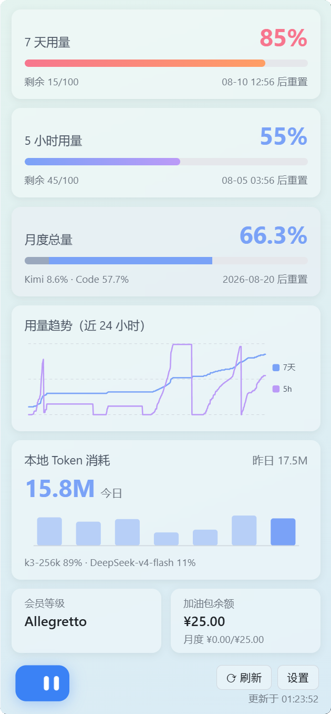
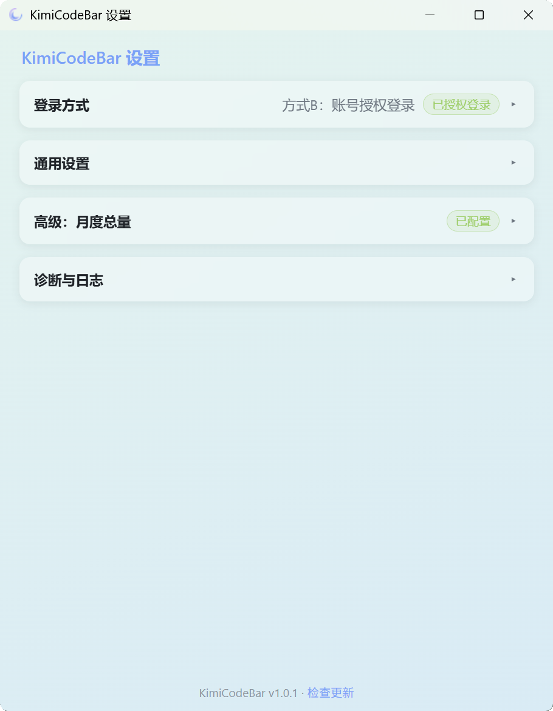
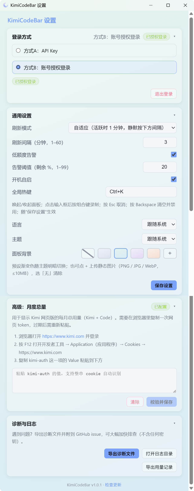

# KimiCodeBar for Windows

**中文 | [English](README_EN.md)**

[](https://github.com/JYH1878/KimiCodeBar-Windows/releases)
[](https://github.com/JYH1878/KimiCodeBar-Windows/actions/workflows/ci.yml)
[](LICENSE)
[](https://github.com/JYH1878/KimiCodeBar-Windows)

Kimi Code 用量监控的 Windows 系统托盘工具。常驻托盘不打扰，左键一点看额度，快烧完了变红提醒你。

基于 **Tauri 2 + Rust + React** 构建：安装包不到 3 MB，运行内存约 10–20 MB。

> **官网**：[jyh1878.github.io/KimiCodeBar-Windows](https://jyh1878.github.io/KimiCodeBar-Windows/)
>
> 社区版本，非 Kimi 官方出品。
>
> **macOS 用户请移步原版 [xifandev/KimiCodeBar](https://github.com/xifandev/KimiCodeBar)**（由 @xifandev 维护，[官网](https://xifandev.github.io/KimiCodeBar/)）——本项目是经原作者认可的 Windows 社区移植版，两仓库分治、各自独立发版。

## 功能特性

- **系统托盘常驻**：左键弹出用量面板（自动定位到托盘图标上方，失焦收起）；右键菜单（刷新 / 设置 / 退出）
- **双窗口用量**：7 天窗口 + 5 小时窗口的已用百分比、剩余量、重置倒计时
- **月度总量**：Kimi + Code 每月总用量分列显示（设置中粘贴一次网页 token 即可）
- **本地消耗统计**：扫描本地 `wire.jsonl` 会话日志，按天统计 token 消耗（今日/昨日 + 近 7 天柱状图 + 今日分模型占比），不依赖 API
- **用量趋势**：近 24 小时双线折线图（7 天/5 小时），本地记录 7 天历史，纯事实不预测
- **会员与钱包**：显示会员档位（Andante / Moderato / Allegretto / Allegro）与加油包（Booster）钱包余额、月度用量
- **双模式登录**
  - **方式A · API Key**：手动输入 `sk-kimi-` 前缀的 Key，存入 Windows 凭据管理器
  - **方式B · 账号授权**：OAuth 设备码流程（与 Kimi Code CLI 相同），浏览器一键授权，自动续期
- **自适应刷新**：默认每 5 分钟轮询（1–60 分钟可调）；检测到本地会话活跃（近 10 分钟有新 token 消耗）时自动加密到 1 分钟、闲置回落，设置页可切换"自适应 / 固定"（默认自适应）
- **低额度预警**：任一窗口剩余低于阈值（默认 20%，可调）时托盘图标变红，并推送系统通知（可关闭）
- **离线可用**：最近一次查询结果本地缓存，断网时照常展示，不报错不崩溃
- **自动更新**：静默检查 GitHub Releases，有新版本时面板出现更新徽标，点击直达下载页
- **全局热键**：任意界面一键唤起/收起面板（如 `Ctrl+Shift+K`，设置页按组合键直接录制，默认关闭）
- **CLI 模式**：`kimicodebar.exe --status` 输出配额 JSON，可接入脚本与 CI/CD（退出码 0/1/2）
- **中英双语**：界面、通知、托盘提示全覆盖（跟随系统 / 中文 / English）
- **浅色 / 深色主题**：跟随系统或手动切换
- **面板背景**：预设渐变色（夜空 / 极光 / 紫藤 / 暖阳，各配明暗两套色随主题切换）或自定义图片（PNG / JPG / WebP，≤10MB），卡片为半透明毛玻璃
- **面板吉祥物**：底栏左角的蓝团子矢量动画（眨眼 + 眼珠左右看），深浅主题自动适配，纯装饰不抢戏
- **用量导出**：一键导出 CSV/JSON 用量记录，方便报销与复盘
- **诊断与日志**：按天滚动运行日志（不含任何凭证）+ 一键导出脱敏诊断文件
- **开机自启**：可选，设置里一键开关

## 界面预览

<p>
  
  &nbsp;&nbsp;
  
  &nbsp;&nbsp;
  
</p>

## 安装

**方式一 · 安装包（推荐）**：到 [Releases](https://github.com/JYH1878/KimiCodeBar-Windows/releases) 下载 `KimiCodeBar_x.x.x_x64-setup.exe`，双击安装——当前用户安装，**无需管理员权限**，装完出现在开始菜单。

**方式二 · 便携版**：下载 `KimiCodeBar_x.x.x_x64-portable.zip`，解压到任意目录直接运行 `kimicodebar.exe`，不写注册表。注意配置与缓存仍存于 `%APPDATA%\KimiCodeBar\`（如需随目录携带，可设置环境变量 `KIMICODEBAR_CONFIG_DIR` 指向自定义目录）。

**方式三 · Scoop**：`scoop bucket add kimicodebar https://github.com/JYH1878/scoop-bucket` 后 `scoop install kimicodebar/kimicodebar`（装的便携版，配置仍在 `%APPDATA%\KimiCodeBar\`；以后 `scoop update kimicodebar` 一键升级）。

首次启动后图标常驻系统托盘（可能在"隐藏的图标"折叠区，拖出来即可）。

系统要求：Windows 10 1809+ / Windows 11；依赖 WebView2 运行时（Windows 11 已预装，缺失时安装包会引导安装）。

> 首次运行可能被 Windows SmartScreen 拦截（应用未购买代码签名证书，属开源软件常见情况）：点击"更多信息"→"仍要运行"即可。

## 使用指南

### 首次配置（二选一）

**方式A · API Key**
1. 打开 [kimi.com/code/console](https://www.kimi.com/code/console) 创建 API Key（以 `sk-kimi-` 开头）
2. 托盘右键 → 设置 → 选择"方式A"→ 粘贴 Key → 保存

**方式B · 账号授权**
1. 托盘右键 → 设置 → 选择"方式B"→ 点击"开始授权登录"
2. 点击"打开浏览器授权"，在网页里确认授权码
3. 授权成功后自动登录，token 到期自动续期

### 日常使用

- **看用量**：左键单击托盘图标
- **手动刷新**：面板上的刷新按钮，或托盘右键 → 刷新
- **调设置**：刷新间隔、告警阈值、告警开关、开机自启均在设置页

## 常见问题

**`sk-kimi-` 的 Key 和开放平台的 `sk-` Key 是一回事吗？**

不是。Kimi Code（kimi.com/code/console）的 Key 以 `sk-kimi-` 开头；开放平台（platform.moonshot.cn）的 `sk-` Key 用于通用大模型 API，两者不互通。本工具只接受 `sk-kimi-` Key（设置页会校验并提示）。

**会员档位 Andante / Moderato / Allegretto / Allegro 是什么？**

Kimi 会员等级的官方命名（音乐速度记号，由慢到快对应由低到高）。工具按 API 返回原样显示。

**加油包（Booster）是什么？**

Kimi Code 的按量付费钱包：订阅额度用完后，可用预存余额继续按量使用。未开通时卡片显示"未开通"；开通后显示余额与月度已用/限额。

**断网了会怎样？**

面板照常展示最近一次成功查询的缓存数据，顶部出现提示横幅，不会报错或崩溃；网络恢复后自动刷新。

**我的数据会被上传到别处吗？**

不会。所有凭证与配置仅存本机（API Key 在 Windows 凭据管理器，其余在 `%APPDATA%\KimiCodeBar\`）。网络请求只发往：`api.kimi.com`（用量）、`auth.kimi.com`（授权）、`api.github.com`（更新检查）。

## 从源码构建

前置：[Rust](https://rustup.rs/)（1.77+）、[Node.js](https://nodejs.org/)（18+）

```bash
git clone https://github.com/JYH1878/KimiCodeBar-Windows.git
cd KimiCodeBar-Windows
npm install

npm run tauri dev     # 开发模式（热更新）
npx tauri build       # 产出 NSIS 安装包与便携 exe（src-tauri/target/release/）
```

运行测试：

```bash
cd src-tauri && cargo test
```

## 技术栈

| 层 | 选型 |
|---|---|
| 框架 | Tauri 2（系统托盘、无边框面板、通知、自启、 opener） |
| 后端 | Rust：reqwest（native-tls）、serde、tokio、keyring（Windows 凭据管理器） |
| 前端 | React 18 + TypeScript + Vite，无重型 UI 依赖 |
| 持久化 | JSON 文件（settings / cache）+ Windows 凭据管理器（API Key）+ 本地凭证文件（OAuth） |
| 打包 | NSIS（当前用户安装，免管理员） |

## 工程与质量

- **CI 门禁**：每次 push / PR 自动执行 `cargo fmt --check`、`cargo clippy -D warnings`、ESLint、`cargo test`（[工作流](.github/workflows/ci.yml)）
- **测试策略**：180+ 单元/集成测试，重点覆盖用量响应的防御性解析（字段缺失、proto3 省略、字段别名、金额单位换算）、OAuth 流程纯逻辑、版本比较、配置读写回环；真实 API 响应脱敏后作为 fixture 常驻回归
- **Dependabot**：每周自动检查 npm / cargo / GitHub Actions 依赖升级并开 PR
- **自动发版**：打 `v*` tag → CI 自动构建 NSIS 安装包与便携 zip → 生成 Release 草稿，人工确认后发布（[工作流](.github/workflows/release.yml)）

## 参与贡献

欢迎 Issue 与 PR，请先阅读 [CONTRIBUTING.md](CONTRIBUTING.md)；遇到问题时可在应用内导出诊断文件（设置 → 诊断与日志）附到 Issue 中。

## 致谢与相关项目

本项目的行为语义与 API 细节（设备码流程、用量响应解析的边界情况）参考了以下项目：

- [xifandev/KimiCodeBar](https://github.com/xifandev/KimiCodeBar) — macOS 原版（MIT 协议），本项目的灵感来源；其[官网](https://xifandev.github.io/KimiCodeBar/)与仓库描述已将 Windows 下载指向本项目
- [Golden0Voyager/kimi-code-usage](https://github.com/Golden0Voyager/kimi-code-usage) — Kimi Code 用量 CLI（Python）参考

## License

[MIT](LICENSE) © 2026 xifandev, JYH1878
